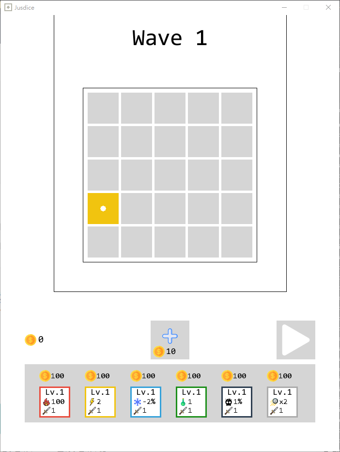
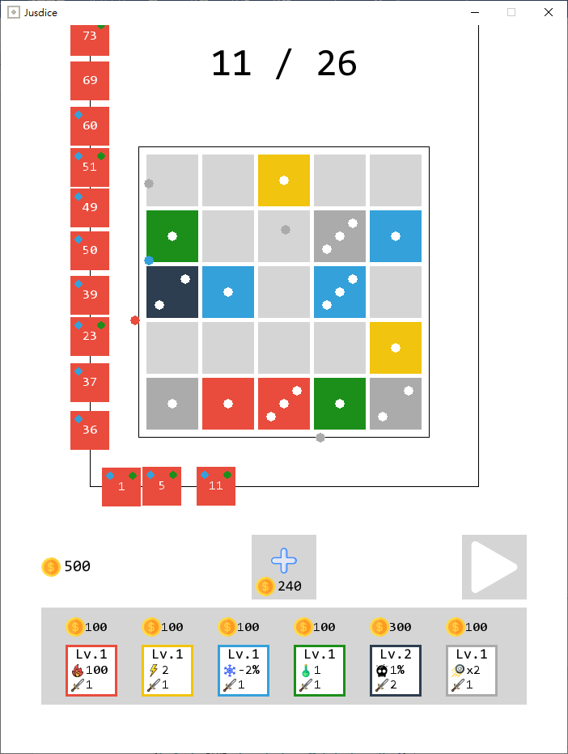

# Jusdice
a game based on [Justice](https://play.google.com/store/apps/details?id=com.crater.dice) written in Python.
# How to play
- Add a dice
- Upgrade a kind of skill
- Combine dices with same points and color
- Try to shoot all of the coming cubes down
- If a cube goes to the right top of the line, game over.
# Screenshots

